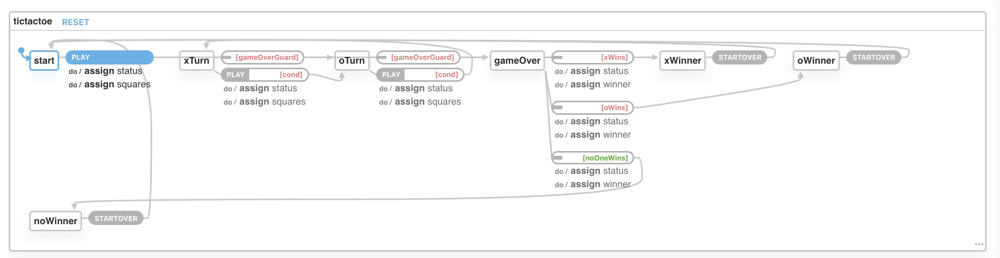

# React TicTacToe with Xstate

This is a game of TicTacToe based on the React Tutorial, but utilizing [Xstsate](https://xstate.js.org/docs/) for state management. The first commit is the basic tutorial code for the game with state managed by the components. Commits after that are when Xstate was introduced. 

To avoid ["state explosion"](https://en.wikipedia.org/wiki/UML_state_machine#Extended_states), we only model game states and not the state of the board itself. The squares of the board are part of the context for the state machine. 

The states of the game are:
- Start
- xTurn - X player's turn
- oTurn - O player's turn
- Game over - a transient state used to determine the winner
- xWinner - X wins the game
- oWinner - O wins the game
- noWinner - No winner ("cat's game")

The original React Tutorial allowed players to traverse through the history, but this [isn't easily modeled in Xstate](https://github.com/davidkpiano/xstate/issues/481#issuecomment-498236063). Individual state nodes can have history, but not the entire machine itself. Instead of overcomplicating this simple example, the history buttons were replaced with a Start Over button that can restart the game after it ends.  

## Template

This project was bootstrapped with [Create React App](https://github.com/facebook/create-react-app).

## Available Scripts

In the project directory, you can run:

### `yarn start`

Runs the app in the development mode. 
Open [http://localhost:3000](http://localhost:3000) to view it in the browser.

The page will reload if you make edits. 
You will also see any lint errors in the console.

### `yarn test`

Launches the test runner in the interactive watch mode. 
See the section about [running tests](https://facebook.github.io/create-react-app/docs/running-tests) for more information.

### `yarn build`

Builds the app for production to the `build` folder. 
It correctly bundles React in production mode and optimizes the build for the best performance.

The build is minified and the filenames include the hashes. 
Your app is ready to be deployed!

See the section about [deployment](https://facebook.github.io/create-react-app/docs/deployment) for more information.

### `yarn eject`

**Note: this is a one-way operation. Once you `eject`, you can’t go back!**

If you aren’t satisfied with the build tool and configuration choices, you can `eject` at any time. This command will remove the single build dependency from your project.

Instead, it will copy all the configuration files and the transitive dependencies (webpack, Babel, ESLint, etc) right into your project so you have full control over them. All of the commands except `eject` will still work, but they will point to the copied scripts so you can tweak them. At this point you’re on your own.

You don’t have to ever use `eject`. The curated feature set is suitable for small and middle deployments, and you shouldn’t feel obligated to use this feature. However we understand that this tool wouldn’t be useful if you couldn’t customize it when you are ready for it.

## Learn More

You can learn more in the [Create React App documentation](https://facebook.github.io/create-react-app/docs/getting-started).

To learn React, check out the [React documentation](https://reactjs.org/).

### Code Splitting

This section has moved here: https://facebook.github.io/create-react-app/docs/code-splitting

### Analyzing the Bundle Size

This section has moved here: https://facebook.github.io/create-react-app/docs/analyzing-the-bundle-size

### Making a Progressive Web App

This section has moved here: https://facebook.github.io/create-react-app/docs/making-a-progressive-web-app

### Advanced Configuration

This section has moved here: https://facebook.github.io/create-react-app/docs/advanced-configuration

### Deployment

This section has moved here: https://facebook.github.io/create-react-app/docs/deployment

### `yarn build` fails to minify

This section has moved here: https://facebook.github.io/create-react-app/docs/troubleshooting#npm-run-build-fails-to-minify
